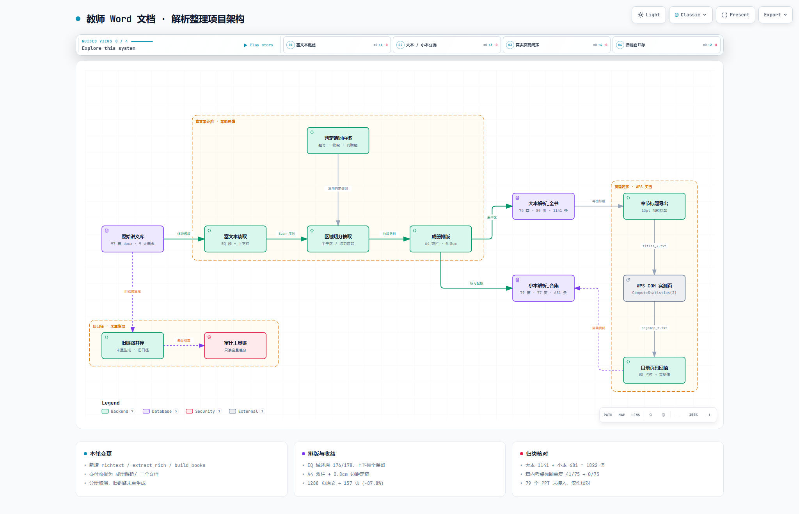
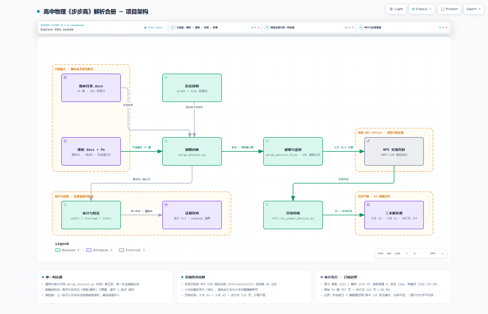

# 一轮复习资料解析提取

> 把《步步高 大一轮》教师用书 Word 版里散落在每篇讲义的**答案与解析**，用一套 Python 流水线抽出来、重新排版、装订成可以打印的解析册子。
>
> 这是我高中阶段做的一个小工程：**生物 + 物理两科，191 篇讲义（2245 页）→ 3 本双栏解析册（272 页）**。

---

## 一、为什么做这个

学校发的那本答案解析，**不是每道题都有详细解析的** —— 大约只有一半题目带解析，前面几道基础题常常只给个答案、没有解题过程。对着错题想不通的时候，就卡在那里了。

老师手上的**教师用书 Word 版有全部解析**。但整本打印不现实：里面有大量题干、选项、知识梳理、图表，一科就上千页，印出来又厚又贵——而真正要看的，只有那几行答案和解析。

所以这个项目的目标很单纯：

> **把「答案 + 解析」从教师用书里挑出来，单独印成薄册子。**

结果是把 2245 页的教师用书，压成 272 页的解析册——**要查的东西一页都不少，不要的东西一行都不留。**

## 二、做了什么

教师用书每篇讲义的结构是「知识梳理 → 例题 → 答案/解析 → 课时精练 → 答案/解析」，
答案和解析夹在大量讲解、题干、选项、图表中间，**要对着找很费劲**。

这套流水线把它变成：

```
原始讲义（每篇 10~20 页，一科上百篇）
        │
        ├─ 按教材目录确定拼装顺序
        ├─ 只保留「答案 / 解析 / 提示」行，丢掉题干与讲解
        ├─ 主干区 → 大本解析      练习区 → 小本解析
        ├─ 公式（OMML）与上下标原样搬运，不丢
        ├─ A4 + 双栏 + 0.8cm 边距排版
        └─ WPS 实测页码 → 回填目录
        │
        ▼
   大本解析 + 小本解析 + 合订本（三份可打印文档）
```

## 三、成果

### 生物（高中生物 步步高 大一轮·广东版）

| 产物 | 规模 | 页数 |
|---|---|---|
| 原始讲义 | 97 篇（A4） | **1288** |
| 大本解析 | 75 章 = 52 讲 + 14 高考共鸣点 + 9 阶段排查（1141 条目） | **80** |
| 小本解析 | 79 篇 = 52 限时练 + 5 强化练 + 22 周末必刷（681 条目） | **77** |
| **合订本** | 154 章篇（1822 条目） | **157** |

**1288 页 → 157 页，缩减 87.8%。**

### 物理（高中物理 步步高 大一轮·广东版）

| 产物 | 规模 | 页数 |
|---|---|---|
| 原始讲义 | 94 篇（A4） | **957** |
| 大本解析 | 94 章 = 81 课时 + 8 微点突破 + 5 阶段复习（595 条目） | **53** |
| 小本解析 | 81 练（每课时一练，671 条目） | **62** |
| **合订本** | 175 章练（1266 条目） | **115** |

**957 页 → 115 页，缩减 88.0%。**

## 四、几个有意思的技术点

### 1. 找回「读不到」的内容

`python-docx` 的 `paragraph.text` 只拼接 `<w:t>`，于是两类内容会**静默消失**：

- **EQ 域**：公式写在 `<w:instrText>` 里（如 `\o\al(上标,下标)` 做化学式的堆叠上下标），`paragraph.text` 完全看不到；
- **OMML 公式**：Word 的公式对象是 `<m:oMath>`，不属于 run，同样读不到。

物理科目尤其致命 —— 第一版产物里解析长这样：

```
解析　甲车匀速运动的速度v甲= m/s=10 m/s，乙车的加速度a== m/s2=2 m/s2
                            ↑ 分数式整块消失        ↑ 也是
```

**解法：不去「提取文本再重建」，而是把源段落的 XML 直接搬过来。**

```python
COPY_TAGS = {W + 'r', M + 'oMath', M + 'oMathPara', W + 'hyperlink'}
for child in src_p._element:
    if child.tag in COPY_TAGS:
        dst_p._element.append(copy.deepcopy(child))
```

一次修好三样：公式、上下标、中西文混排字体（源文档数字/字母用 Times New Roman，中文用宋体，原先被强改成全宋体）。

> ⚠️ 踩坑记录：`oMath` 属于 **math 命名空间**（`.../officeDocument/2006/math`），不是 wordprocessingml。
> 一开始误写成 `W + 'oMath'`，结果是**复制数 0、且不报任何错**——静默失败。
> 必须回读验证公式计数，不能只看脚本有没有抛异常。

### 2. 版式不是拍脑袋定的，是实测择优

同一份内容生成 9 套变体，用 **WPS COM 的 `ComputeStatistics(2)` 实测页数**再选：

| 方案（生物） | 大本 | 小本 | 合计 |
|---|---|---|---|
| 单栏 + Letter | 101 | 97 | 198 |
| 双栏 + Letter | 88 | 85 | 173 |
| 单栏 + A4 | 96 | 93 | 189 |
| **双栏 + A4** | **86** | **83** | **169** |

再扫左右边距：

| 左右边距 | 每行字数 | 合计页数 |
|---|---|---|
| 1.5 cm | 24 | 169 |
| 1.0 cm | 25 | 161 |
| **0.8 cm（采用）** | **25** | **157** |
| 0.6 cm | 26 | 155 |

0.6cm 只多省 2 页，但正文距纸边仅 0.6cm，而多数打印机不可打印区是 0.4~0.5cm ——
**只剩 0.1cm 余量，有裁边风险**，所以停在 0.8cm。

> 顺带发现的坑：产物纸张一直是 **Letter**（python-docx 默认模板值），
> 而老师给的原件**本来就是 A4**。项目从始至终只设过页边距、没设过纸张尺寸。

### 3. 目录页码闭环

```
export_titles.py      从产物提取章节标题（13pt 加粗）
        ↓
wps_pagemap.ps1       开 WPS，逐段定位标题 → Range.Information(wdActiveEndPageNumber)
        ↓
fill_toc_pages.py     把实测页码回填目录的 00 占位
```

页码不是估算的。生物 154 条、物理 175 条目录，**0 个占位、0 个逆序**。

### 4. 审计口径本身也会出错

写完流水线后我做了「原文 vs 产物」差分审计，一度报出**几百条「疑似凭空添加」**。
逐条查证后确认：**全部是审计脚本自己的假警报**。

原因是产物首行是「题号 + 来源 + 原文首行」的**合并串**，而头部形态远不止 `例N / 思考 / N.`：

- `问` —— 提取器对以 `？` 结尾的无编号题返回的头部；
- `(N)` 子题；
- `[变式N]` / 裸 `变式` ……

靠「穷举头部形态去剥」或「放宽包含阈值」都是打补丁。最后改成**精确重建**：
按渲染规则重建产物应有的每一行，再逐条比对。歧义彻底消失，**漏缺 0、凭空 0**。

> 教训：**报出异常时，先自证口径。** 一个自相矛盾的指标（比如"覆盖率 86%"却"缺失 0 条"）
> 往往说明测量方法错了，而不是被测对象有问题。

## 五、架构图

两科流水线**形状相同、难点不同**：生物要处理的是 EQ 域（化学式的堆叠上下标，`python-docx` 读不到），物理要处理的是 OMML 公式对象（物理解析没有公式基本不可读）。

### 生物

[`架构图/biology-pipeline.html`](架构图/biology-pipeline.html) —— 交互式架构图（下载后离线打开）



### 物理

[`架构图/physics-pipeline.html`](架构图/physics-pipeline.html) —— 交互式架构图（下载后离线打开）



> GitHub 不渲染仓库里的 `.html`，点开会是源码。想看可交互版本：下载后用浏览器打开，
> 或开启 GitHub Pages 后访问 `https://439909208.github.io/Review-Analysis/架构图/physics-pipeline.html`。

## 六、目录结构

```
一轮复习资料解析提取/
├── 生物解析/脚本/         26 个（Python 22 + PowerShell 4）
├── 物理解析/脚本/         17 个（Python 13 + PowerShell 4）
└── 架构图/
    ├── biology-pipeline.html / .light.png / .dark.png / .architecture.json
    └── physics-pipeline.html / .light.png / .dark.png / .architecture.json
```

**生物核心脚本**

| 脚本 | 作用 |
|---|---|
| `richtext.py` | 富文本读层：`w:t` + EQ 域 → span（含上下标标记） |
| `extract_rich.py` | 抽取内核：白名单 + 续段链 + 主干/练习区段切分 |
| `build_books.py` | 成册：大本 / 分册 / 小本 / 合订本，版面可配置 |
| `merge_jiexi.py` | 逐篇解析抽取（旧链路，与上者共用判定规则） |
| `export_titles.py` → `wps_pagemap.ps1` → `fill_toc_pages.py` | 页码闭环 |

**物理核心脚本**

| 脚本 | 作用 |
|---|---|
| `merge_physics.py` | 抽取内核：前瞻结构法判题 + 续段链 + 目录映射 |
| `merge_physics_v2.py` | 在 v1 规则之上改 XML 级复制渲染，并切分大本/小本/合订本 |
| `export_titles_physics.py` → `wps_pagemap_physics.ps1` → `fill_toc_pages_physics.py` | 三本页码闭环 |
| `audit_physics.py` / `verify_output.py` | 审计与回读验证 |

## 七、运行

依赖：**Python 3.11**（`python-docx`、`lxml`）+ **WPS Office**（COM，用于页码实测；Word 同理，改 ProgID 即可）。

```bash
# 生物
python build_books.py --out 成册解析 --cols 2 --paper a4 --margin-lr 0.8
python export_titles.py
powershell -Sta -ExecutionPolicy Bypass -File wps_pagemap.ps1
python fill_toc_pages.py

# 物理
python merge_physics_v2.py --cols 2 --paper a4 --margin-lr 0.8
python export_titles_physics.py
powershell -Sta -ExecutionPolicy Bypass -File wps_pagemap_physics.ps1
python fill_toc_pages_physics.py
```

所有脚本**只读原始讲义**，产物可随时重建。

`.ps1` 已改为可移植写法：

```powershell
param([string]$root = (Get-Location).Path)   # cd 到项目文件夹直接跑，或 -root 指定
```

> 注意：Windows PowerShell 5.1 读取含中文的 `.ps1` **必须 UTF-8 with BOM**，
> 否则中文会变乱码且报诡异的语法错误。

## 八、说明

- 本仓库**只包含我自己写的代码与架构图**。
- **不含**《步步高 大一轮》的原始讲义、课件或提取后的成品文档 ——
  那些内容的版权属于出版方，不适合公开分发。
- 上面所有页数、条目数、公式数均为**实测数据**（WPS COM / 文档 XML 解析），
  不是估算值。

---

*高中三年的一个小纪念。*
